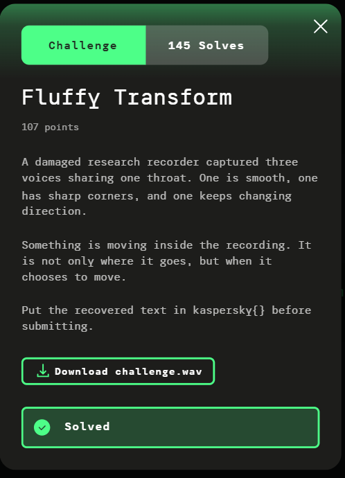

# Fluffy Transform

**Platform:** Kaspersky CTF 2026

**Category:** Misc

**Flag:** kaspersky{P4WS_1N_TH3_SP3CTRUM}

**Solution code:** [misc_fluffy_transform_solve.py](../code/misc_fluffy_transform_solve.py)

## Table of Contents

- [Fluffy Transform](#fluffy-transform)
  - [Table of Contents](#table-of-contents)
  - [Challenge Description](#challenge-description)
  - [TL;DR](#tldr)
  - [Recon](#recon)
    - [WAV Metadata](#wav-metadata)
    - [Frequency Analysis](#frequency-analysis)
    - [Interpreting the Hint](#interpreting-the-hint)
  - [Exploitation](#exploitation)
    - [1. Demodulate the Three Carriers](#1-demodulate-the-three-carriers)
    - [2. Recover the Three Coordinates](#2-recover-the-three-coordinates)
    - [3. Sample the Trajectory Every 1 ms](#3-sample-the-trajectory-every-1-ms)
    - [4. Measure Movement in 75 ms Slots](#4-measure-movement-in-75-ms-slots)
    - [5. Convert Movement to Bits](#5-convert-movement-to-bits)
    - [6. Decode Timing-Based Morse](#6-decode-timing-based-morse)
    - [7. Build the Flag](#7-build-the-flag)
  - [Final Output](#final-output)
  - [Dead Ends](#dead-ends)
    - [Treating It as Speech](#treating-it-as-speech)
    - [Trying a Single Envelope](#trying-a-single-envelope)
    - [Ignoring Waveform-Specific Scaling](#ignoring-waveform-specific-scaling)
    - [Thresholding the Raw Audio](#thresholding-the-raw-audio)
    - [Searching for Morse by Amplitude Alone](#searching-for-morse-by-amplitude-alone)
  - [Finding](#finding)
  - [Tools Used](#tools-used)
  - [Lessons Learned](#lessons-learned)

## Challenge Description



Provided challenge resource:

```text
challenge.wav
```

## TL;DR

The file is not a normal audio-message challenge. It contains three independently modulated low-frequency coordinate signals hidden on different carrier frequencies. A spectrum inspection reveals carriers near **997 Hz**, **2203 Hz**, and **4211 Hz**. The three envelopes behave as X/Y/Z coordinates: one is sinusoidal, one is square-like, and one is triangle-like. After demodulating those carriers and undoing the square/triangle fundamental-amplitude scaling, the three envelopes form a moving point in 3-D. Sampling that point every **1 ms** and summing its travelled distance over **75 ms** windows turns movement into a binary stream. The first seven slots are framing; the remaining slots encode Morse through timing: one moving slot is a dot, three are a dash, and zero slots separate symbols and words. The decoded payload is `P4WS_1N_TH3_SP3CTRUM`, giving the flag `kaspersky{P4WS_1N_TH3_SP3CTRUM}`. No speech recognition or OCR is required.

## Recon

### WAV Metadata

The file is a mono, 16-bit, 48 kHz WAV with a duration of 21.025 seconds.

```bash
ffprobe -v error -show_entries format=duration:stream=sample_rate,channels,bits_per_sample -of default=noprint_wrappers=1 challenge_f25cea1608c1e224.wav
```

Trimmed output:

```text
sample_rate=48000
channels=1
bits_per_sample=16
duration=21.025000
```

That gives:

```text
48,000 samples/second
1,009,200 samples
21.025 seconds
```

The 48 kHz sample rate is convenient because the encoded coordinate stream later turns out to use a clean **1 ms** sampling interval, corresponding to 48 audio samples.

### Frequency Analysis

A short FFT of the middle of the recording shows strong components around three useful carrier frequencies. The FFT bin spacing for a 0.5 second window is 2 Hz, so the observed peaks are close to the actual carrier values:

```text
2202 Hz    strong
4210 Hz    strong
998 Hz     strong
```

The complete signal also contains harmonics, especially around the higher-frequency carrier and its multiples. The three useful carrier frequencies are recovered as:

```text
997 Hz
2203 Hz
4211 Hz
```

A minimal spectrum check can be reproduced with Python:

```python
import numpy as np
import soundfile as sf
from scipy.signal import find_peaks

audio, sr = sf.read("challenge_f25cea1608c1e224.wav", dtype="float64")
segment = audio[int(1.0 * sr):int(1.5 * sr)]
window = np.hanning(segment.size)
spectrum = np.abs(np.fft.rfft(segment * window))
frequencies = np.fft.rfftfreq(segment.size, 1 / sr)

peaks, _ = find_peaks(spectrum, distance=20)
indices = peaks[np.argsort(spectrum[peaks])[-10:]][::-1]
for index in indices:
    print(f"{frequencies[index]:.2f} Hz {spectrum[index]:.3g}")
```

Relevant output is approximately:

```text
2202.00 Hz 1.41e+03
4210.00 Hz 9.70e+02
998.00 Hz 4.63e+02
```

The small offsets are caused by FFT-bin quantization; the actual carriers are the nearby integer frequencies listed above.

### Interpreting the Hint

The challenge text gives the structure almost directly once the spectrum is visible.

- **“three voices sharing one throat”** suggests three signals mixed into one audio channel.
- **“one is smooth”** suggests a sine wave.
- **“one has sharp corners”** suggests a square wave.
- **“one keeps changing direction”** suggests a triangle wave.
- **“Something is moving inside the recording”** suggests treating the recovered envelopes as coordinates of a moving point.
- **“not only where it goes, but when it chooses to move”** suggests that the travelled distance is binary information, while the duration of movement encodes timing.

The solve therefore becomes a signal-recovery problem instead of a speech-analysis problem.

## Exploitation

### 1. Demodulate the Three Carriers

Each coordinate is amplitude-modulated onto its own carrier. To recover one envelope, mix the recording with a complex exponential at the carrier frequency and then low-pass filter the result.

For carrier `fc`, the code is:

```python
t = np.arange(audio.size, dtype=np.float64) / sr
a = audio * np.exp(-2j * np.pi * fc * t)
```

The high-frequency carrier is removed with an 8th-order 80 Hz low-pass filter. Taking the magnitude produces the envelope:

```python
sos = butter(
    8,
    80.0 / (sr / 2.0),
    btype="lowpass",
    output="sos",
)
envelope = 2.0 * np.abs(sosfiltfilt(sos, a))
```

The factor of `2` compensates for the positive-frequency half of the analytic mixing result.

The three carriers are therefore recovered independently:

```python
x = demodulate(audio, sr, 997.0)
y = demodulate(audio, sr, 2203.0)
z = demodulate(audio, sr, 4211.0)
```

### 2. Recover the Three Coordinates

The first carrier is the smooth/sinusoidal channel, so its envelope can be used directly as the X coordinate.

The other two channels require waveform-specific scaling corrections.

For a 50% duty-cycle square wave, the fundamental amplitude is:

```text
4 / pi
```

times the square-wave amplitude. Therefore the envelope recovered from the fundamental is divided by `4/pi`, equivalently multiplied by `pi/4`.

For a unit-amplitude triangle wave, the fundamental amplitude is:

```text
8 / pi^2
```

times the triangle-wave amplitude. Therefore its recovered envelope is multiplied by `pi^2/8`.

The coordinate reconstruction is:

```python
x = demodulate(audio, sr, 997.0)
y = demodulate(audio, sr, 2203.0) * np.pi / 4.0
z = demodulate(audio, sr, 4211.0) * (np.pi**2) / 8.0
```

The recovered arrays now represent a point moving through 3-D space:

```text
(x[t], y[t], z[t])
```

### 3. Sample the Trajectory Every 1 ms

The encoded movement is much slower than the audio carriers. Because the WAV is sampled at 48 kHz, one millisecond is exactly 48 samples.

```python
sample_step = round(sr * 1.0 / 1000.0)
coords = np.column_stack((x, y, z))[::sample_step]
```

The movement between adjacent coordinate samples is the ordinary Euclidean distance:

```python
distance = np.linalg.norm(np.diff(coords, axis=0), axis=1)
```

This converts the problem from an audio waveform into a one-dimensional travelled-distance signal sampled once per millisecond.

### 4. Measure Movement in 75 ms Slots

The challenge uses 75 ms timing units. Starting at 1000 ms into the recording, sum the travelled distance in each 75 ms window.

There are 267 slots in the recorded payload region:

```python
START_MS = 1000
SLOT_MS = 75
SLOT_COUNT = 267

slot_distances = []
for i in range(SLOT_COUNT):
    start = START_MS + i * SLOT_MS
    end = start + SLOT_MS
    slot_distances.append(distance[start:end].sum())
```

The resulting values separate into two clear populations. Non-moving slots are only a few thousandths of a unit, while moving slots are around a few hundredths of a unit or more. There is a large gap around `0.01`.

For example, sorting the recovered slot distances shows the important separation:

```text
largest low values: 0.0041687 ... 0.0046636
smallest high value: 0.0258580 ...
```

There is therefore no need for a fragile statistical classifier: `0.01` sits safely between the two populations.

### 5. Convert Movement to Bits

Movement is encoded as `1`; no movement is encoded as `0`.

```python
bits = (slot_distances > 0.01).astype(np.uint8)
```

The first seven slots are framing/synchronization. The payload begins at slot seven:

```python
bits = bits[7:]
```

At this point the recording is no longer treated as audio. It is a timed binary stream.

### 6. Decode Timing-Based Morse

The binary stream uses standard Morse timing, but each timing unit is one 75 ms slot.

For `1` runs:

```text
1 slot -> dot
3 slots -> dash
```

For `0` runs:

```text
1 slot  -> gap inside a character
3 slots -> gap between characters
>=7     -> word separator
```

Run-length encoding converts the bitstream into these timing runs.

```python
runs = []
current = int(bits[0])
length = 1

for bit in bits[1:]:
    bit = int(bit)
    if bit == current:
        length += 1
    else:
        runs.append((current, length))
        current, length = bit, 1

runs.append((current, length))
```

The marks are then mapped to Morse symbols:

```python
current_symbol = ""

for value, length in runs:
    if value == 1:
        current_symbol += "." if length == 1 else "-"
    elif length == 3:
        symbols.append(current_symbol)
        current_symbol = ""
    elif length >= 7:
        if current_symbol:
            symbols.append(current_symbol)
            current_symbol = ""
        symbols.append(" ")
```

The standard Morse alphabet, plus `_`, is enough to decode the result.

The recovered plaintext is:

```text
P4WS_1N_TH3_SP3CTRUM
```

The string is intentionally written in leetspeak, so the first character pair is `P4WS` rather than a natural-language word.

### 7. Build the Flag

The challenge explicitly specifies the `kaspersky{}` wrapper. The recovered text is therefore inserted directly:

```text
kaspersky{P4WS_1N_TH3_SP3CTRUM}
```

## Final Output

```text
$ python3 solve.py challenge_f25cea1608c1e224.wav
[+] WAV: 48000 Hz, 1009200 samples
[+] movement threshold: 0.010000
[+] recovered text: P4WS_1N_TH3_SP3CTRUM
[+] flag: kaspersky{P4WS_1N_TH3_SP3CTRUM}
```

## Dead Ends

### Treating It as Speech

The three carrier frequencies are far too structured for a normal speech recording. Speech recognition would throw away the useful timing information. The useful representation is the low-frequency envelope after demodulation.

### Trying a Single Envelope

Demodulating only one carrier does not reveal a complete message. The challenge deliberately spreads the coordinates across three separate carriers. The useful signal appears only after combining all three recovered envelopes into a 3-D trajectory.

### Ignoring Waveform-Specific Scaling

Using the raw square-wave and triangle-wave fundamental amplitudes produces distorted Y/Z coordinates. Distance measurements become inconsistent near movement boundaries. Applying `pi/4` and `pi^2/8` restores the intended coordinate amplitudes and makes the movement/no-movement separation clear.

### Thresholding the Raw Audio

The binary payload is not represented by carrier amplitude at a single frequency. It is represented by **movement of the reconstructed point**, so the correct order is carrier demodulation -> coordinates -> distance -> timed slots -> bits.

### Searching for Morse by Amplitude Alone

The Morse information is encoded by **run length**, not by a special carrier for dots and dashes. A one-slot movement is a dot and a three-slot movement is a dash. The zero runs carry the character and word spacing.

## Finding

The core finding is that the WAV implements a layered analog-looking transport for a very ordinary digital message: three modulated coordinate channels are reconstructed into motion, and that motion is then used as a timed Morse carrier.

## Tools Used

- `ffprobe` — inspect WAV metadata.
- Python 3 — spectrum inspection and the complete decoder.
- `numpy` — FFTs, coordinate arrays, vectorized distance calculations, and run-length handling.
- `scipy.signal` — carrier mixing and zero-phase Butterworth low-pass filtering.
- `soundfile` — read the WAV samples without an external audio player.

## Lessons Learned

- **Inspect the spectrum before trying to interpret audio semantically.** Multiple strong carriers can turn an apparent audio puzzle into a straightforward signal-processing task.
- **The modulation waveform matters.** Square and triangle waves have different fundamental-amplitude relationships, so their envelopes must be rescaled before combining coordinates.
- **Translate timing into the natural abstraction.** Once movement is summed in fixed 75 ms slots, the audio problem becomes a clean binary RLE/Morse decoding problem.
- **Validate each layer independently.** The carrier frequencies, 1 ms coordinate sampling, 75 ms slotting, 0.01 movement threshold, and Morse timing all produce consistent intermediate results before the final flag is built.
