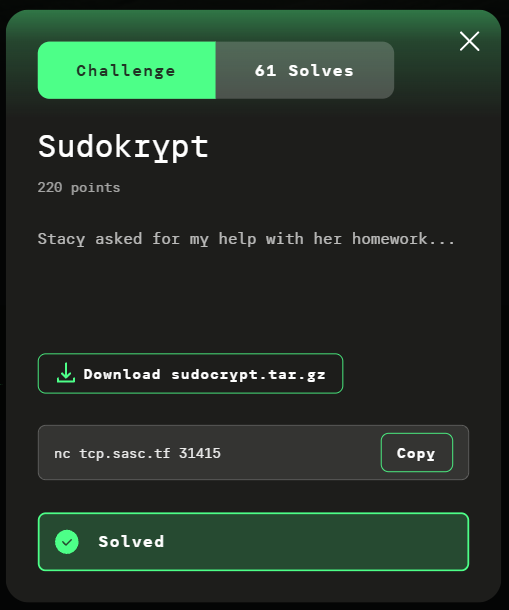

# Sudokrypt

**Platform:** Kaspersky CTF 2026

**Category:** Crypto

**Flag:** kaspersky{D4mn_1m_s0_c00l!!_1_c4n_d0_sud0ku_n0w_st4cy_t0t4lly_g01ng_t0_pr0m_w1th_m3}

**Solution code:** [crypto_sudokrypt_solve.py](../code/crypto_sudokrypt_solve.py)

## Table of Contents

- [Sudokrypt](#sudokrypt)
  - [Table of Contents](#table-of-contents)
  - [Challenge Description](#challenge-description)
  - [TL;DR](#tldr)
  - [Challenge Summary](#challenge-summary)
  - [Recon](#recon)
    - [Service Enumeration](#service-enumeration)
    - [Source-Code Review](#source-code-review)
    - [Important Parameters](#important-parameters)
    - [Chosen Plaintext](#chosen-plaintext)
  - [Exploitation](#exploitation)
    - [Attack Chain](#attack-chain)
    - [1. Collect All 96 Oracle Blocks](#1-collect-all-96-oracle-blocks)
    - [2. Reverse the Public Outer Layers](#2-reverse-the-public-outer-layers)
    - [3. Recover Candidate Stream Values](#3-recover-candidate-stream-values)
    - [4. Resolve `symbol_inv[0]` and the Block Rotation](#4-resolve-symbol_inv0-and-the-block-rotation)
    - [5. Recover the Common Order-56 Recurrence](#5-recover-the-common-order-56-recurrence)
    - [6. Recover the 56 Spectral Nodes](#6-recover-the-56-spectral-nodes)
    - [7. Recover the 16 × 56 Spectral Coefficients](#7-recover-the-16--56-spectral-coefficients)
    - [8. Verify the Recovered Spectral Model](#8-verify-the-recovered-spectral-model)
    - [9. Reproduce `fold_for_flag()`](#9-reproduce-fold_for_flag)
    - [10. Reverse the Flag Encryption](#10-reverse-the-flag-encryption)
  - [Final Output](#final-output)
  - [Finding](#finding)
  - [Dead Ends](#dead-ends)
    - [Brute-Forcing the Flag](#brute-forcing-the-flag)
    - [Recovering the Session Key](#recovering-the-session-key)
    - [Solving Each Lane Independently](#solving-each-lane-independently)
    - [Ignoring the Block Rotation](#ignoring-the-block-rotation)
    - [Requesting the Flag Too Early](#requesting-the-flag-too-early)
  - [Tools Used](#tools-used)
  - [Lessons Learned](#lessons-learned)

## Challenge Description



Provided challenge resources:

```text
sudocrypt.tar.gz
│
└── static/
    ├── server.py
    └── sudokrypt_core.py
```

## TL;DR

`Sudokrypt` exposes a chosen-plaintext encryption oracle with a strict limit of **96 queries**. The cipher combines Hexadoku encoding, a public Feistel-like wrapper, word diffusion, block rotation, and a finite-field spectral generator. The critical weakness is that all 16 stream lanes are generated from the same **56 spectral nodes over GF(4093)**. By encrypting `00 11 22 ... ff` repeatedly, the hidden `symbol` value becomes zero for every byte, allowing the outer cipher layers to be reversed and candidate stream values to be recovered. The 96 samples are then sufficient to reconstruct a common order-56 recurrence, recover its 56 spectral nodes and 16 × 56 coefficient matrix, reproduce `fold_for_flag()`, predict the flag stream, and decrypt the six encrypted flag blocks. **The original session key never needs to be recovered.**

## Challenge Summary

`Sudokrypt` exposes a custom 16-byte block encryption service over TCP.

The encryption oracle accepts chosen 16-byte plaintext blocks, but only **96 queries** are available. A separate menu option returns an encrypted copy of Stacy's homework, which contains the flag. That operation can only be used once.

The encryption pipeline is:

```text
plaintext
    ↓
inner_word()
    ↓
block rotation
    ↓
public_wrapper()
    ↓
diffuse_words()
    ↓
ciphertext
```

The stream values used by `inner_word()` come from a custom spectral generator operating over `GF(4093)`.

The apparent target is the secret session state. However, the spectral generator has a structural weakness: **all 16 lanes share the same 56 spectral nodes**. Each lane has different coefficients, but the common nodes mean that every lane follows the same characteristic polynomial and therefore the same linear recurrence.

The complete attack is:

1. Use all 96 chosen-plaintext queries with `00 11 22 ... ff`.
2. Reverse the public diffusion and Feistel-like wrapper.
3. Recover candidate stream values from the known plaintext structure.
4. Resolve `symbol_inv[0]` and the per-block rotation.
5. Recover the common order-56 recurrence over `GF(4093)`.
6. Recover the 56 spectral nodes.
7. Recover the 16 × 56 spectral coefficient matrix.
8. Verify the reconstructed model against all 96 oracle samples.
9. Reproduce the generator's `fold_for_flag()` transition.
10. Predict the flag stream and decrypt the six encrypted flag blocks.

## Recon

### Service Enumeration

The challenge exposes a TCP service at:

```text
tcp.sasc.tf:31415
```

The service can be accessed with:

```bash
nc tcp.sasc.tf 31415
```

The menu provides four operations:

```text
1) encrypt one block
2) peek at Stacy's homework
3) how many queries are left
4) get me out
```

The important properties are:

- plaintext must contain exactly **16 bytes**;
- plaintext is supplied as exactly **32 hexadecimal characters**;
- only **96 encryption queries** are available;
- Stacy's homework can be requested only once;
- requesting the homework prevents further normal encryption queries.

The query limit is important because the attack requires the entire oracle transcript. The 96 queries must therefore be planned before requesting the encrypted flag.

### Source-Code Review

The server creates a `SudoKrypt` instance using a master seed and a randomly generated session nonce:

```python
core = SudoKrypt(
    seed=os.environ.get("CHALLENGE_SEED", "0"),
    session_nonce=session_nonce,
)
```

The instance key is derived from the master key and session nonce:

```python
instance_key = derive(
    master,
    b"session/" + session_nonce,
)
```

The session nonce is generated with `os.urandom(16)`, so recovering the original session key is not a practical direction for the attack.

More importantly, the oracle exposes enough information to reconstruct the **spectral stream model itself**. Once the spectral nodes and coefficients are known, the stream can be reproduced without recovering the original key material.

The normal block encryption reaches:

```python
crypt_block(plaintext)
```

The flag is encrypted through:

```python
core.encrypt_flag(flag)
```

Before the flag blocks are encrypted, the generator executes:

```python
prng.fold_for_flag()
```

The flag is then PKCS#7-padded and encrypted block by block.

### Important Parameters

The spectral generator uses:

```python
FIELD = 4093
GENERATOR = 2
SPECTRUM_SIZE = 56
```

Therefore, the spectral calculations are performed in:

```text
GF(4093)
```

and each stream lane is represented using **56 spectral nodes**.

The nodes are shared by all 16 lanes, while every lane has its own 56 coefficients.

The challenge also uses a fixed 4-bit S-box:

```python
SBOX = (
    6, 4, 12, 5,
    0, 7, 2, 14,
    1, 15, 3, 13,
    8, 10, 9, 11,
)
```

The Hexadoku layer and the outer transformations are fully defined in `sudokrypt_core.py`. They are therefore reproducible and, where inverse functions exist, directly reversible.

### Chosen Plaintext

All 96 oracle queries use the same plaintext:

```python
bytes((i << 4) | i for i in range(16))
```

which produces:

```text
00 11 22 33 44 55 66 77 88 99 aa bb cc dd ee ff
```

or:

```text
00112233445566778899aabbccddeeff
```

This plaintext is specifically chosen to simplify `inner_word()`.

For every byte, the implementation calculates:

```python
q = byte >> 4
symbol = ((byte & 15) - q) & 15
```

For a byte `0xXY` where `X == Y`:

```text
symbol = (Y - X) mod 16
       = 0
```

Therefore:

```text
00 11 22 33 44 55 66 77 88 99 aa bb cc dd ee ff
```

produces:

```text
symbol = 0
```

for every byte.

This is the key property of the chosen plaintext. It removes the unknown symbol value from the `inner_word()` equations and makes the hidden stream values recoverable through a small candidate search.

## Exploitation

### Attack Chain

The complete solve can be summarized as:

```text
96 × chosen-plaintext queries
        │
        ▼
00 11 22 ... ff
        │
        ▼
reverse diffusion
        │
        ▼
reverse public wrapper
        │
        ▼
recover candidate stream values
        │
        ▼
resolve symbol_inv[0] + rotations
        │
        ▼
96 samples × 16 lanes
        │
        ▼
common order-56 recurrence
        │
        ▼
56 spectral nodes
        │
        ▼
16 × 56 spectral coefficients
        │
        ▼
verify recovered generator
        │
        ▼
reproduce fold_for_flag()
        │
        ▼
predict six flag stream blocks
        │
        ▼
reverse flag encryption
        │
        ▼
FLAG
```

The attack does **not** recover the session key. It reconstructs the part of the internal state that is sufficient to reproduce the encryption stream.

### 1. Collect All 96 Oracle Blocks

The complete oracle budget is used with:

```text
00112233445566778899aabbccddeeff
```

The solver is started with:

```bash
python3 solve.py
```

The collection phase completes all 96 queries:

```text
[+] connecting to tcp.sasc.tf:31415
[+] collecting 96 oracle blocks...
    8/96
    16/96
    24/96
    32/96
    40/96
    48/96
    56/96
    64/96
    72/96
    80/96
    88/96
    96/96
[+] requesting encrypted flag...
```

The encrypted homework returned by the service is:

```text
52fd940cd3fa855b8bec235690006c20867a8b9d07ebebc6c94a600407ed2999
54f082732d8c09eb276a5830901d41e60da7575f6bf1d9c450e6b3cf099e9774
67fbccd2df0b085ce2f27d2a4759425a53d37102ce375d79ab9fa9b0ff9de272
77835ad28fe1d616a0add5952c5fd4c2be1c49ca75311c136903ddf50d579628
66a6b04ca6b4d72ee989c4804e2a666fe1401534c171b631d7ff90aee970a1c
696d10e60f89459a708314944fd68f6eda276fb30b13ce5c6a0fd5c42189e3a90
```

This is **192 hexadecimal characters = 96 bytes**.

`crypt_block()` returns 32 bytes for every 16-byte plaintext block, so the homework consists of **six 32-byte ciphertext blocks**.

The important ordering is:

```text
1. Consume all 96 encryption queries.
2. Request the encrypted homework.
```

Requesting the homework earlier prevents further oracle queries.

### 2. Reverse the Public Outer Layers

The ciphertext does not directly expose the stream values.

After constructing the inner words, `crypt_block()` applies a block rotation, the public wrapper, and word diffusion:

```python
rotation = block_rotation(values, block_number)

ranked = [
    words[(rank + rotation) & 15]
    for rank in range(16)
]

wrapped = [
    public_wrapper(word, rank)
    for rank, word in enumerate(ranked)
]

ciphertext = diffuse_words(wrapped)
```

The source provides inverse operations for the two outer transformations.

For each oracle block, the solver therefore performs:

```text
ciphertext
    ↓
undiffuse_words()
    ↓
public_wrapper_inv()
    ↓
inner words
```

The wrapper inverse depends on the word rank, so the words cannot simply be treated as an unordered collection.

After this step, the public diffusion and Feistel-like layer have been removed. What remains is the Hexadoku encoding, the unknown stream values, and the block rotation.

### 3. Recover Candidate Stream Values

Because the chosen plaintext forces:

```text
symbol = 0
```

the `inner_word()` construction becomes much easier to invert.

The word contains information derived from:

- the plaintext high nibble `q`;
- the Hexadoku row;
- the Hexadoku column;
- a check nibble;
- nibbles derived from the stream value.

The low nibble of the stream value can be enumerated directly:

```python
for low in range(16):
    row_code = SBOX[low]
```

The row code determines a candidate base column:

```python
base_col = (symbol_inv[symbol] - row_code) & 15
```

The candidate is rejected when the resulting column does not match the column field encoded in the word.

The check field then provides enough information to recover the remaining stream information.

The result is a set of candidate stream values for each recovered inner word.

The important point is that **the stream does not have to be guessed as a 16-bit or 32-bit secret value**. The chosen plaintext reduces the problem to a small 4-bit enumeration followed by deterministic consistency checks.

### 4. Resolve `symbol_inv[0]` and the Block Rotation

Two unknowns remain after extracting candidate stream values:

```text
symbol_inv[0]
```

and the rotation applied to the 16 words in each block.

The rotation is calculated as:

```python
rotation = (
    sum(values)
    + 3 * values[0]
    + block_number
) & 15
```

Therefore, only 16 rotation values are possible.

The solver tests all 16 possibilities for each block. A candidate rotation is accepted only when the resulting stream assignments remain consistent with the plaintext `q` values.

The search state is propagated across the complete 96-block transcript.

The candidate count quickly collapses:

```text
[+] block  2/96: 2 candidate state(s)
[+] block  3/96: 1 candidate state(s)
...
[+] block 96/96: 1 candidate state(s)
```

The unique solution gives:

```text
[+] symbol_inv[0] = 15
[+] q_perm = [10, 15, 5, 12, 9, 11, 7, 1, 6, 3, 4, 13, 14, 8, 0, 2]
```

At this point, the 96 oracle ciphertext blocks have been converted into **96 samples of the underlying 16-lane stream**.

### 5. Recover the Common Order-56 Recurrence

The spectral generator is the critical weakness.

For a particular lane, the stream has the form:

```text
s[t] = Σ c[j] · node[j]^t
```

where there are 56 spectral nodes.

A sequence consisting of a linear combination of 56 exponentials satisfies a linear recurrence of order at most 56:

```text
s[t+56] =
    r[0]  · s[t]
  + r[1]  · s[t+1]
  + ...
  + r[55] · s[t+55]
```

with all arithmetic performed modulo 4093.

The important property is that **the same 56 nodes are used by every one of the 16 lanes**.

Therefore, all 16 lanes share the same characteristic polynomial and the same recurrence coefficients. Only their coefficient vectors differ.

Each lane contains 96 samples, providing:

```text
96 - 56 = 40
```

recurrence equations.

Using all 16 lanes gives:

```text
16 × 40 = 640 equations
```

for only 56 unknown recurrence coefficients.

The solver starts this stage with:

```text
[+] solving common order-56 recurrence...
```

Using all lanes simultaneously makes the recovery substantially more constrained than treating the lanes as independent sequences.

### 6. Recover the 56 Spectral Nodes

Once the recurrence coefficients are known, its characteristic polynomial is:

```text
P(x) = x^56 - Σ r[i] x^i
```

The spectral nodes are roots of this polynomial.

The challenge constructs the nodes as powers of the multiplicative generator:

```python
GENERATOR = 2
```

over `GF(4093)`.

The solver therefore tests values of the form:

```text
2^e mod 4093
```

for the allowed exponents and checks which values are roots of the recovered polynomial.

Exactly 56 nodes are recovered:

```text
[+] recovered 56 spectral nodes
```

The complete spectral basis is now known.

### 7. Recover the 16 × 56 Spectral Coefficients

For every lane:

```text
s[t] = Σ c[j] · node[j]^t
```

Once the nodes are known, the first 56 samples produce a 56 × 56 linear system.

The matrix has the form:

```text
[ 1          1          ... 1          ]
[ n[0]       n[1]       ... n[55]      ]
[ n[0]^2     n[1]^2     ... n[55]^2    ]
[ ...        ...        ... ...        ]
[ n[0]^55    n[1]^55    ... n[55]^55   ]
```

This is a Vandermonde-style system over `GF(4093)`.

The system is solved independently for each of the 16 lanes.

The result is:

```text
[+] recovered 16 x 56 spectral coefficients
```

The solver now has the complete spectral representation:

```text
56 spectral nodes
+
16 × 56 spectral coefficients
```

This is sufficient to reproduce future stream blocks.

### 8. Verify the Recovered Spectral Model

Before decrypting the target ciphertext, the recovered model is tested against the complete 96-block oracle transcript.

This is a necessary validation step. Recovering a recurrence that happens to fit a subset of the samples is not sufficient; the reconstructed nodes and coefficients must reproduce the entire observed stream.

The solver reports:

```text
[+] verifying spectral model...
[+] spectral model verified
```

The reconstructed model therefore reproduces all 96 observed oracle blocks.

At this point, **the original session key is no longer relevant to the attack**. The observable spectral state needed to predict future blocks has been reconstructed directly from the oracle.

### 9. Reproduce `fold_for_flag()`

The flag is not encrypted directly from the state after oracle block 96.

`encrypt_flag()` first executes:

```python
prng.fold_for_flag()
```

The fold changes every spectral state term using:

```python
shift = 1 + (
    coefficient * (lane + 1)
    + (j + 3) * (j + 7)
) % (FIELD - 1)
```

This transformation is deterministic.

Because the solver has already recovered the spectral nodes and coefficients, it can reproduce the folded state without knowing the original session key.

The flag stream can therefore be generated directly for the blocks following the 96 oracle queries.

The solver reports:

```text
[+] generating 6 folded flag stream blocks
```

There are six flag ciphertext blocks because the encrypted homework is 192 hexadecimal characters, or 96 bytes, and each `crypt_block()` call produces 32 ciphertext bytes.

### 10. Reverse the Flag Encryption

The flag ciphertext is decrypted by reversing the encryption pipeline:

```text
ciphertext
    ↓
undiffuse_words()
    ↓
public_wrapper_inv()
    ↓
calculate folded stream
    ↓
calculate block rotation
    ↓
restore original word order
    ↓
decrypt inner words
    ↓
PKCS#7 unpadding
    ↓
flag
```

The oracle has already consumed blocks `0` through `95`, so the first flag block uses **block number 96**.

This matters because the block rotation depends explicitly on `block_number`:

```python
rotation = (
    sum(values)
    + 3 * values[0]
    + block_number
) & 15
```

Using the wrong block number would produce the wrong word ordering even with a correct folded stream.

The recovered `q_perm`, the known Hexadoku model, and the recovered spectral generator are then used to reverse `inner_word()`.

Finally, the plaintext is PKCS#7-unpadded and the flag is recovered.

## Final Output

```text
$ python3 solve.py
[+] connecting to tcp.sasc.tf:31415
[+] collecting 96 oracle blocks...
    8/96
    16/96
    24/96
    32/96
    40/96
    48/96
    56/96
    64/96
    72/96
    80/96
    88/96
    96/96
[+] requesting encrypted flag...
[+] encrypted flag: 52fd940cd3fa855b8bec235690006c20867a8b9d07ebebc6c94a600407ed299954f082732d8c09eb276a5830901d41e60da7575f6bf1d9c450e6b3cf099e977467fbccd2df0b085ce2f27d2a4759425a53d37102ce375d79ab9fa9b0ff9de27277835ad28fe1d616a0add5952c5fd4c2be1c49ca75311c136903ddf50d57962866a6b04ca6b4d72ee989c4804e2a666fe1401534c171b631d7ff90aee970a1c696d10e60f89459a708314944fd68f6eda276fb30b13ce5c6a0fd5c42189e3a90
[+] block  2/96: 2 candidate state(s)
[+] block  3/96: 1 candidate state(s)
[+] block  4/96: 1 candidate state(s)
[+] block  5/96: 1 candidate state(s)
[+] block  6/96: 1 candidate state(s)
[+] block  7/96: 1 candidate state(s)
[+] block  8/96: 1 candidate state(s)
[+] block  9/96: 1 candidate state(s)
[+] block 10/96: 1 candidate state(s)
[+] block 11/96: 1 candidate state(s)
[+] block 12/96: 1 candidate state(s)
[+] block 13/96: 1 candidate state(s)
[+] block 14/96: 1 candidate state(s)
[+] block 15/96: 1 candidate state(s)
[+] block 16/96: 1 candidate state(s)
[+] block 17/96: 1 candidate state(s)
[+] block 18/96: 1 candidate state(s)
[+] block 19/96: 1 candidate state(s)
[+] block 20/96: 1 candidate state(s)
[+] block 21/96: 1 candidate state(s)
[+] block 22/96: 1 candidate state(s)
[+] block 23/96: 1 candidate state(s)
[+] block 24/96: 1 candidate state(s)
[+] block 25/96: 1 candidate state(s)
[+] block 26/96: 1 candidate state(s)
[+] block 27/96: 1 candidate state(s)
[+] block 28/96: 1 candidate state(s)
[+] block 29/96: 1 candidate state(s)
[+] block 30/96: 1 candidate state(s)
[+] block 31/96: 1 candidate state(s)
[+] block 32/96: 1 candidate state(s)
[+] block 33/96: 1 candidate state(s)
[+] block 34/96: 1 candidate state(s)
[+] block 35/96: 1 candidate state(s)
[+] block 36/96: 1 candidate state(s)
[+] block 37/96: 1 candidate state(s)
[+] block 38/96: 1 candidate state(s)
[+] block 39/96: 1 candidate state(s)
[+] block 40/96: 1 candidate state(s)
[+] block 41/96: 1 candidate state(s)
[+] block 42/96: 1 candidate state(s)
[+] block 43/96: 1 candidate state(s)
[+] block 44/96: 1 candidate state(s)
[+] block 45/96: 1 candidate state(s)
[+] block 46/96: 1 candidate state(s)
[+] block 47/96: 1 candidate state(s)
[+] block 48/96: 1 candidate state(s)
[+] block 49/96: 1 candidate state(s)
[+] block 50/96: 1 candidate state(s)
[+] block 51/96: 1 candidate state(s)
[+] block 52/96: 1 candidate state(s)
[+] block 53/96: 1 candidate state(s)
[+] block 54/96: 1 candidate state(s)
[+] block 55/96: 1 candidate state(s)
[+] block 56/96: 1 candidate state(s)
[+] block 57/96: 1 candidate state(s)
[+] block 58/96: 1 candidate state(s)
[+] block 59/96: 1 candidate state(s)
[+] block 60/96: 1 candidate state(s)
[+] block 61/96: 1 candidate state(s)
[+] block 62/96: 1 candidate state(s)
[+] block 63/96: 1 candidate state(s)
[+] block 64/96: 1 candidate state(s)
[+] block 65/96: 1 candidate state(s)
[+] block 66/96: 1 candidate state(s)
[+] block 67/96: 1 candidate state(s)
[+] block 68/96: 1 candidate state(s)
[+] block 69/96: 1 candidate state(s)
[+] block 70/96: 1 candidate state(s)
[+] block 71/96: 1 candidate state(s)
[+] block 72/96: 1 candidate state(s)
[+] block 73/96: 1 candidate state(s)
[+] block 74/96: 1 candidate state(s)
[+] block 75/96: 1 candidate state(s)
[+] block 76/96: 1 candidate state(s)
[+] block 77/96: 1 candidate state(s)
[+] block 78/96: 1 candidate state(s)
[+] block 79/96: 1 candidate state(s)
[+] block 80/96: 1 candidate state(s)
[+] block 81/96: 1 candidate state(s)
[+] block 82/96: 1 candidate state(s)
[+] block 83/96: 1 candidate state(s)
[+] block 84/96: 1 candidate state(s)
[+] block 85/96: 1 candidate state(s)
[+] block 86/96: 1 candidate state(s)
[+] block 87/96: 1 candidate state(s)
[+] block 88/96: 1 candidate state(s)
[+] block 89/96: 1 candidate state(s)
[+] block 90/96: 1 candidate state(s)
[+] block 91/96: 1 candidate state(s)
[+] block 92/96: 1 candidate state(s)
[+] block 93/96: 1 candidate state(s)
[+] block 94/96: 1 candidate state(s)
[+] block 95/96: 1 candidate state(s)
[+] block 96/96: 1 candidate state(s)
[+] symbol_inv[0] = 15
[+] q_perm = [10, 15, 5, 12, 9, 11, 7, 1, 6, 3, 4, 13, 14, 8, 0, 2]
[+] solving common order-56 recurrence...
[+] recovered 56 spectral nodes
[+] recovered 16 x 56 spectral coefficients
[+] verifying spectral model...
[+] spectral model verified
[+] generating 6 folded flag stream blocks

============================================================
FLAG: kaspersky{D4mn_1m_s0_c00l!!_1_c4n_d0_sud0ku_n0w_st4cy_t0t4lly_g01ng_t0_pr0m_w1th_m3}
============================================================
```

## Finding

The weakness is a **chosen-plaintext stream-recovery vulnerability in the custom spectral construction**.

The outer cipher layers do not provide meaningful protection once their public inverse operations are applied. More importantly, the 16 stream lanes are not independent: they all use the same 56 spectral nodes.

This creates a common order-56 linear recurrence over `GF(4093)`.

The 96 available oracle samples are enough to recover:

- the common recurrence;
- the 56 spectral nodes;
- the 16 × 56 spectral coefficient matrix;
- the stream state required for future blocks.

Because `fold_for_flag()` is deterministic once the spectral model is known, the flag stream can then be predicted and the encrypted homework decrypted.

**The attack therefore recovers the encryption stream without recovering the underlying session key.**

## Dead Ends

### Brute-Forcing the Flag

Brute-forcing the flag is not practical.

The flag is encrypted by a custom block construction, and the generator state is modified by `fold_for_flag()` before flag encryption. There is no sufficiently small plaintext search space exposed by the service.

The useful target is therefore the **stream generator**, not the flag plaintext.

### Recovering the Session Key

The instance key is derived from a random session nonce:

```python
instance_key = derive(
    master,
    b"session/" + session_nonce,
)
```

Trying to recover this key is unnecessary.

The oracle provides enough information to reconstruct the spectral model directly. Once the spectral nodes and coefficients are known, the stream can be reproduced without recovering the original key material.

### Solving Each Lane Independently

Each lane has its own coefficient vector, so treating all 16 lanes as unrelated sequences is tempting.

That misses the most important property of the generator:

> **All 16 lanes use the same 56 spectral nodes.**

The shared nodes imply a shared characteristic polynomial and therefore a shared recurrence.

Combining the observations from all lanes gives a much stronger system and exposes the common spectral basis.

### Ignoring the Block Rotation

The recovered inner words are not in their original plaintext order.

The encryption code applies:

```python
rotation = block_rotation(values, block_number)

ranked = [
    words[(rank + rotation) & 15]
    for rank in range(16)
]
```

Ignoring this rotation results in apparently valid word candidates but inconsistent stream assignments across the blocks.

The rotation has to be recovered together with the stream mapping.

### Requesting the Flag Too Early

The 96 oracle queries must be consumed before requesting the encrypted homework.

The correct sequence is:

```text
1. Use all 96 chosen-plaintext queries.
2. Recover the stream samples.
3. Recover the spectral model.
4. Verify the spectral model.
5. Request the encrypted homework.
6. Reproduce the folded stream.
7. Decrypt the flag.
```

Requesting the flag too early prevents additional oracle queries and can leave insufficient data to reconstruct the order-56 spectral model.

## Tools Used

- `nc` — manual interaction with the TCP challenge service.
- `python3` — oracle interaction and the complete cryptanalysis.
- **Python standard library** — networking, hashing, byte manipulation, and finite-field operations.
- **Finite-field linear algebra** — recovery of the common order-56 recurrence and spectral coefficients.
- **Provided challenge resources** — `server.py` and `sudokrypt_core.py`, used to reverse the public transformations and reproduce the spectral generator.

## Lessons Learned

- **Exploit structure before attacking the key.** A complicated custom cipher can still be vulnerable when its internal state follows a low-order linear recurrence.
- **Choose plaintexts that simplify the implementation's algebra.** `00 11 22 ... ff` forces `symbol = 0` for every byte and exposes useful constraints inside `inner_word()`.
- **Shared spectral nodes are the critical weakness.** Sixteen lanes with different coefficients but the same 56 nodes expose one common characteristic polynomial.
- **Verify cryptographic reconstruction before attacking the target.** Matching the recovered model against all 96 oracle samples provides a strong correctness check.
- **Model state transitions exactly.** The `fold_for_flag()` operation and block-number-dependent rotation are both essential to correctly predicting the flag encryption state.
- **Treat query limits as part of the cryptographic problem.** The 96-query budget has to be allocated deliberately because requesting the flag terminates oracle access.
